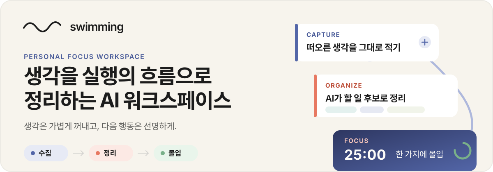
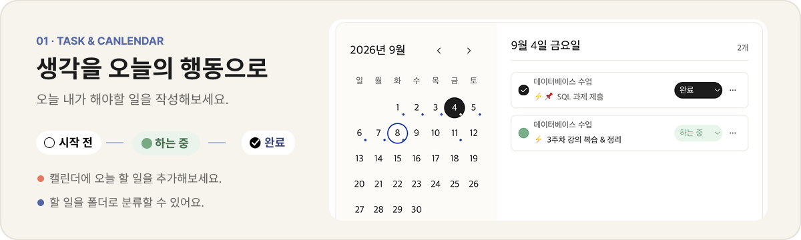
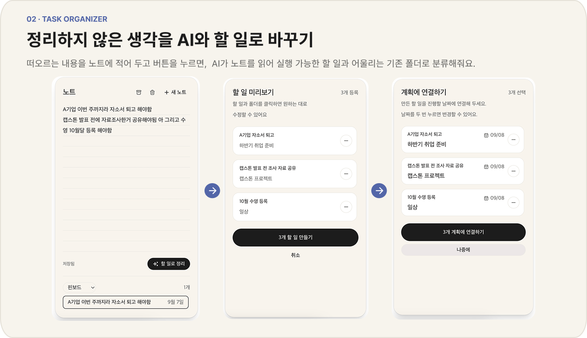
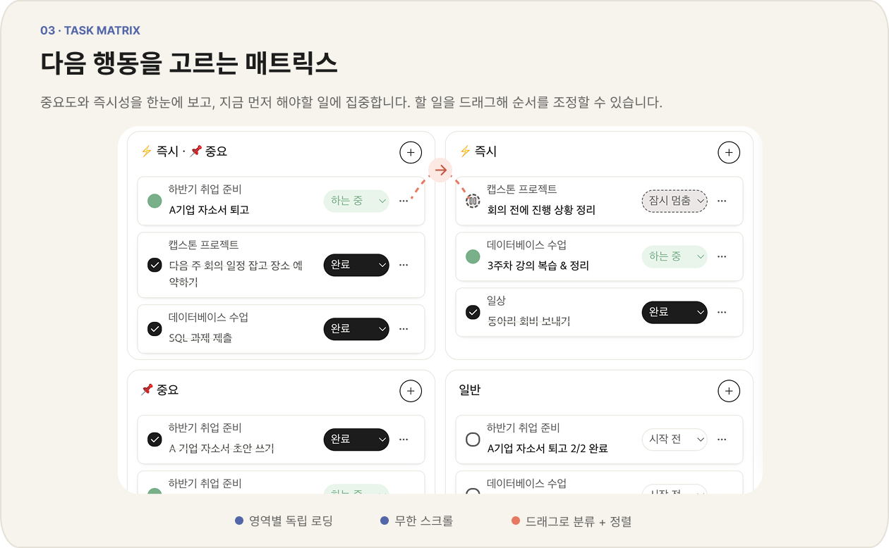
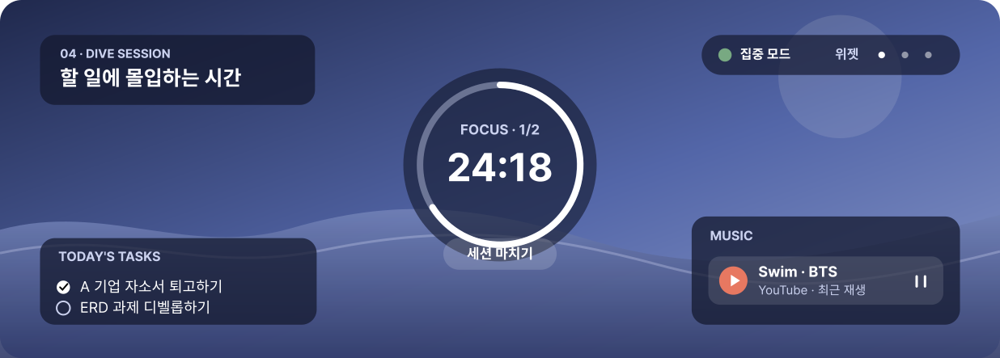
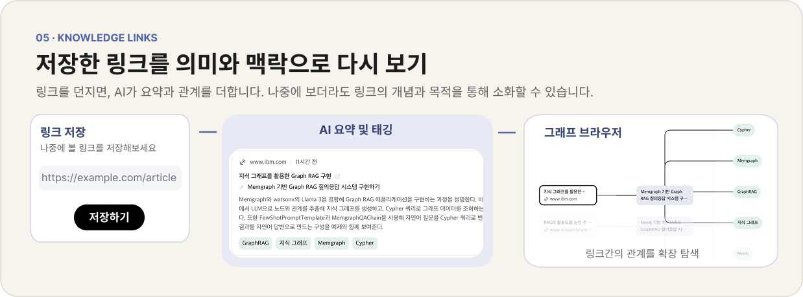
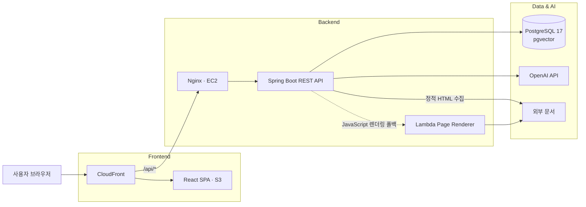
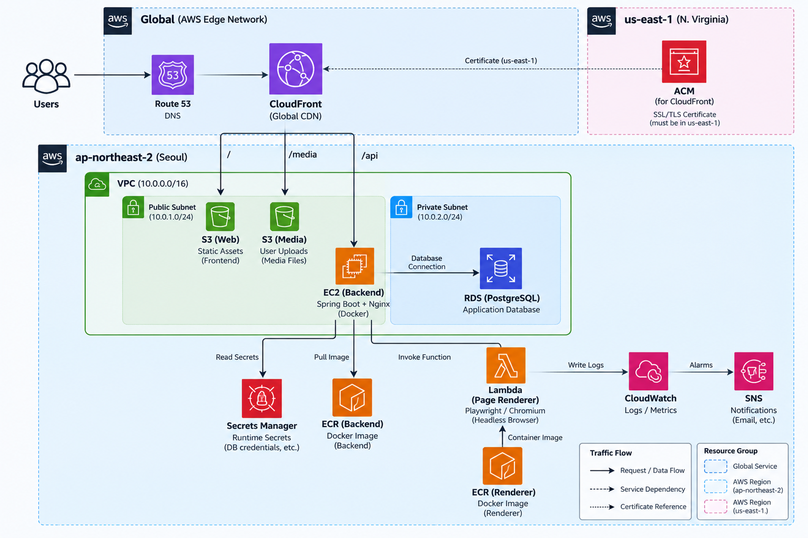

<p align="center">
  
</p>

<p align="center">
  <a href="backend/build.gradle"></a>
  <a href="backend/build.gradle"></a>
  <a href="frontend/package.json"></a>
  <a href="docker-compose.yml"></a>
</p>

<p align="center">
  <a href="#-빠르게-시작하기">빠르게 시작하기</a>
  ·
  <a href="#-작동-방식">작동 방식</a>
  ·
  <a href="#-아키텍처">아키텍처</a>
</p>

Swimming은 쏟아지는 정보와 해야 할 일 속에서, 생각을 정리하고 목표를 향한 첫 행동을 시작하기 어려운 사람들을 위한 서비스입니다.
해야 할 일이 많아 어디서부터 시작해야 할지 막막할 때, 머릿속의 생각을 꺼내 실행 가능한 단위로 정리하고 목표에 집중할 수 있는 환경을 제공합니다.

처음부터 완벽한 분류와 계획을 요구하지 않습니다. 메모나 링크를 먼저 수집하고, AI가 제안한 정리 결과를 확인한 뒤, 오늘 할 일과 집중 세션으로 이어 갑니다. 진척은 부족한 양이나 지연 경고 대신 지금까지 완료한 일과 쌓인 집중 기록으로 보여 줍니다.

## 🌊 작동 방식

| 1. Capture | 2. Organize | 3. Focus |
| --- | --- | --- |
| 떠오른 생각과 다시 보고 싶은 정보는 고민하지 않고 먼저 꺼내놓습니다. | AI가 맥락에 맞게 정리한 제안을 바탕으로, 지금 해야 할 일과 우선순위를 정합니다. | 한 가지 일을 고르고 나에게 맞는 시간과 환경에서 몰입한 뒤, 그 과정을 기록으로 남깁니다. |

Swimming은 이 흐름을 네 가지 원칙으로 설계했습니다.

- **먼저 꺼내놓기** — 어디에 어떻게 정리할지 고민하기보다, 생각과 정보를 놓치지 않는 것부터 시작합니다.
- **AI에게 정리는 맡기고, 결정은 직접 하기** — AI가 맥락을 읽고 정리와 연결을 제안하되, 무엇을 실행할지는 사용자가 결정합니다.
- **지금 할 한 가지에 집중하기** — 쌓여 있는 모든 일을 보여주기보다, 지금 시작할 행동을 선명하게 만듭니다.
- **해낸 과정을 쌓아가기** — 완료한 일과 몰입한 시간을 기록해, 다음 행동으로 이어지는 흐름을 만듭니다.

## ✦ 주요 기능

### 01. 할 일을 오늘로 가져오기

<p align="center">
  
</p>

해야 할 일이 떠오르면 어디에 둘지 고민하지 않고 먼저 적습니다. 나중에 여유가 생겼을 때 폴더와 상태를 정리하고, 지금 시작할 일은 캘린더로 가져옵니다.

- 아직 분류하기 어려운 일도 미분류 상태로 남겨 생각을 놓치지 않습니다.
- 폴더와 캘린더를 오가며 할 일을 다시 입력하지 않고 이어서 정리합니다.
- 오늘 하기로 고른 일은 그대로 집중 세션으로 연결합니다.

### 02. 정리하지 않은 생각을 AI와 할 일로 바꾸기

<p align="center">
  
</p>

떠오르는 내용을 형식 없이 노트에 적어 두고 `할 일로 정리`를 선택합니다. AI가 노트 전체를 읽어 실행 가능한 할 일과 어울리는 기존 폴더를 제안하며, 사용자가 확인하기 전에는 아무것도 저장하지 않습니다.

- 이어지는 생각은 하나로 모으고 여러 행동은 나누어, 시작하기 쉬운 할 일 제목으로 정리합니다.
- 미리보기에서 제목과 폴더를 직접 바꾸거나 원하지 않는 항목을 제외하며 최종 결정을 내립니다.
- 승인한 항목만 할 일로 만들고, 원하는 날짜의 계획에 연결하거나 나중을 위해 남겨 둡니다.

### 03. 많은 할 일 사이에서 지금 할 한 가지 고르기

<p align="center">
  
</p>

할 일이 길게 쌓여도 전부를 한꺼번에 판단할 필요는 없습니다. Task Matrix에서 `즉시`와 `중요`를 기준으로 일을 나누어 보고, 지금 손을 댈 한 가지를 고릅니다.

- 네 영역을 비교하며 급한 일과 중요한 일을 구분합니다.
- 카드를 옮기는 것만으로 판단과 실행 순서를 함께 정리합니다.
- 마우스나 키보드로 원하는 위치를 조정하며 자신에게 맞는 우선순위를 만듭니다.

### 04. 나에게 맞는 환경에서 한 가지에 몰입하기

<p align="center">
  
</p>

오늘 하기로 한 일에서 한 가지를 고르고, 집중 시간과 공간, 음악을 내 리듬에 맞게 정합니다. Dive Session에 들어가면 필요한 정보만 남아 다른 판단을 줄이고 선택한 일에 머물 수 있습니다.

- 화면을 잠시 벗어났다가 돌아와도 흐르던 집중 시간을 그대로 이어 봅니다.
- 배경과 음악을 조절하고, 필요하지 않은 위젯은 접어 몰입 환경을 단순하게 만듭니다.
- 세션을 마치며 실제 집중 시간과 끝낸 일, 짧은 기록을 남겨 오늘의 성취를 쌓습니다.

### 05. 저장한 링크를 의미와 맥락으로 다시 보기

<p align="center">
  
</p>

다시 보고 싶은 링크는 제목이나 분류를 고민하지 않고 폴더에 저장합니다. AI가 정리한 요약과 개념, 활용 목적을 따라가며 문서의 의미를 빠르게 되짚고 다음 생각으로 확장합니다.

- 목록에서는 저장한 자료를 차분히 읽고, 그래프에서는 같은 개념과 목적을 공유하는 자료를 발견합니다.
- 문서 제목이나 저장 위치가 기억나지 않아도 무엇을 다뤘는지, 왜 저장했는지를 단서로 다시 찾습니다.
- 읽은 자료를 표시하고 필요하면 다시 정리하거나 삭제하며 지식 공간을 계속 다듬습니다.

## ⚡ 빠르게 시작하기

JDK 21, Node.js 22, Docker와 Docker Compose가 필요합니다. AI 기능에는 OpenAI API key가 필요하며, Google 로그인을 확인하려면 Google OAuth Web Client ID를 준비해야 합니다.

### 1. 로컬 설정과 PostgreSQL

```bash
cp backend/.env.example backend/.env.local
docker compose up -d
```

복사한 파일의 `OPENAI_API_KEY`, `PLACE_CDN_BASE_URL`을 로컬 환경에 맞게 설정합니다. Google 로그인에는 frontend와 backend가 같은 Client ID를 사용해야 합니다.

### 2. Backend

```bash
cd backend
./gradlew bootRun
```

Backend는 `http://localhost:8080`에서 실행됩니다.

### 3. Frontend

새 터미널에서 실행합니다.

```bash
cd frontend
npm ci
npm run dev
```

Frontend는 `http://localhost:5173`에서 실행됩니다. Vite는 `/api`와 `/ws` 요청을 `localhost:8080`으로 전달합니다.

### 4. 동작 확인

```bash
curl http://localhost:8080/api/health
```

- Swagger UI: `http://localhost:8080/swagger-ui/index.html`
- OpenAPI JSON: `http://localhost:8080/v3/api-docs`

## 🏗 아키텍처

Frontend와 Backend는 독립 프로세스로 배포되는 모노레포입니다. Backend는 도메인별 `Controller → UseCase → Service → Repository` 구조를 사용하고, Flyway가 PostgreSQL 스키마 변경을 관리합니다.



JavaScript로 본문을 만드는 문서는 선택적으로 Lambda에서 렌더링합니다. 이 경로는 기본적으로 비활성화되어 있으며, 정적 HTML 수집이 먼저 실행됩니다.

### 핵심 데이터 관계

- 사용자는 폴더, Task, 메모, 세션과 지식 노드를 소유합니다.
- Task는 폴더 없이 `미분류`로 둘 수 있고, 캘린더와 세션에서 재사용합니다.
- 개인 세션은 여러 Task와 연결되며 종료 시 실제 집중 시간과 Task별 완료 여부를 보존합니다.
- Knowledge Source는 하나의 폴더에 속하며 여러 Subject와 하나의 Topic에 연결됩니다.
- Subject는 사용자 범위에서 재사용하고 Topic은 Source마다 별도로 생성합니다.

전체 관계는 [ERD](docs/erd.mmd), 실제 DDL은 [Flyway migration](backend/src/main/resources/db/migration), 설계 결정은 [Architecture](docs/ARCHITECTURE.md)에서 확인할 수 있습니다.

## 🛠 기술 스택

| 영역 | 기술 | 버전·용도 |
| --- | --- | --- |
| Frontend | React, TypeScript, Vite | React 19.2.8, TypeScript 6.0.3, Vite 8.2.1 |
| State & API | Zustand, Axios, React Router | 5.0.15, 1.19.0, 7.18.2 |
| Graph UI | React Flow | 12.11.6 |
| Backend | Java, Spring Boot, Gradle | Java 21, Spring Boot 4.1.0, Gradle 9.5.1 |
| AI | Spring AI | 2.0.0 |
| Data | PostgreSQL, pgvector, JPA, Flyway | PostgreSQL 17, 768차원 Summary embedding |
| Infrastructure | Docker, Terraform, AWS | EC2, RDS, ECR, S3, CloudFront, Lambda, SSM, Secrets Manager |

<details>
<summary><strong>디렉터리 구조 보기</strong></summary>

```text
swimming/
├── backend/                    # Spring Boot API와 도메인 로직
│   └── src/
│       ├── main/java/...       # auth, folder, task, plan, session, note, knowledge
│       ├── main/resources/     # 설정, 프롬프트, Flyway migration
│       └── test/               # 계층별 Backend 테스트
├── frontend/                   # React SPA
│   └── src/
│       ├── api/                # 공통 API 클라이언트
│       ├── features/           # 기능별 화면·상태·API 연동
│       ├── store/              # Zustand 전역 상태
│       └── styles/             # 디자인 토큰과 전역 스타일
├── infra/                      # Lambda, 배포 스크립트와 Terraform
├── docs/                       # PRD, Architecture, ERD와 기능 정의
├── .github/workflows/          # CI와 배포 워크플로
├── docker-compose.yml          # 로컬 PostgreSQL·선택적 renderer
└── compose.production.yaml     # 운영 Backend 컨테이너
```

</details>

## ✓ 검증

```bash
cd backend
./gradlew test
./gradlew build
./gradlew postgresCheck  # 로컬 PostgreSQL 필요
```

```bash
cd frontend
npm run lint
npm run build
```

기본 Backend 테스트는 H2를 사용하며 실제 네트워크가 필요한 LLM 평가·웹 수집·PostgreSQL 태그 테스트는 제외합니다. Frontend CI는 lint와 TypeScript/Vite production build를 실행합니다.

## ☁️ 시스템 아키텍처

<p align="center">
  
</p>

### 배포 
- Frontend: Vite build → 비공개 S3 → CloudFront
- Backend: Docker image → immutable ECR tag → SSM을 통한 단일 EC2 배포
- Database: private PostgreSQL 17 RDS와 Flyway migration
- Runtime secret: AWS Secrets Manager
- 관측: CloudWatch log와 EC2/RDS alarm

`main` 브랜치 변경 시 GitHub Actions가 변경 경로에 따라 Frontend, Backend와 page renderer를 각각 배포합니다. Terraform 변경 Pull Request에서는 format, validate와 plan을 실행하고 실제 apply는 로컬 승인 절차로 남겨 둡니다.

현재 운영 구성은 단일 EC2·단일 AZ이며 ALB, WAF와 무중단 배포는 포함하지 않습니다. 초기 구축, TLS, state와 장애 대응은 [AWS 인프라 가이드](infra/terraform/README.md)를 따릅니다.
