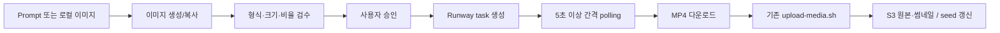

# Asset Generation Pipeline

이미지 준비부터 Runway image-to-video 생성, 기존 S3 미디어 업로드까지 한 화면에서 실행하는 독립형 Gradio 도구입니다. 기존 React/Spring 앱과 의존성을 공유하지 않으며 생성물은 `asset-gen/outputs/`에 저장합니다.

## Overview

새 이미지는 OpenAI Image API로 생성하고, 기존 이미지는 로컬 파일로 가져옵니다. 결정적으로 확인 가능한 Runway 입력 조건만 자동 검수한 뒤 사용자가 이미지를 승인하면 Runway task를 생성하고 상태를 polling합니다. 영상 생성이 완료되면 결과를 로컬에 다운로드하고 기존 `infra/scripts/upload-media.sh`로 선택적으로 업로드할 수 있습니다.

API key가 없어도 UI는 시작됩니다. 이미지 또는 영상 생성 버튼을 누르면 필요한 환경변수를 안내하는 오류를 표시하며 가짜 성공 결과는 만들지 않습니다.

## Tech Stack

| 구분 | 기술 | 버전 |
| --- | --- | --- |
| Runtime | Python | 3.12에서 검증 |
| Web UI | Gradio | 6.26.0 |
| Image | OpenAI Python SDK / Pillow | 3.11.0 / 11.3 이상 |
| Video | RunwayML Python SDK | 5.20.0 |
| Test | pytest | 8.4 이상 |

## Architecture



외부 API 호출은 `services/`에 분리되어 있고 `app.py`는 입력과 상태 표시만 조율합니다. Runway에는 로컬 이미지를 HTTPS 서버에 먼저 올리지 않고 공식 지원 data URI로 전달합니다.

## Directory Structure

```text
asset-gen/
├── app.py                       # Gradio Blocks UI와 파이프라인 조율
├── services/
│   ├── image_generator.py       # OpenAI Image API 호출 및 저장
│   ├── image_validator.py       # Runway 입력 조건 검수와 data URI 변환
│   ├── video_generator.py       # Runway task 생성·조회·결과 다운로드
│   └── media_uploader.py        # 기존 업로드 스크립트 wrapper
├── tests/                       # key 누락·검수·payload·UI smoke test
├── outputs/                     # 생성 및 업로드 이미지/영상 저장 위치
├── styles.css                   # 도구 전용 UI 스타일
├── requirements.txt
├── .env.example
└── README.md
```

## Configuration

```bash
cd asset-gen
cp .env.example .env
```

| 환경변수 | 필수 시점 | 설명 | 기본값 |
| --- | --- | --- | --- |
| `OPENAI_API_KEY` | 새 이미지 생성 | OpenAI API key | 없음 |
| `OPENAI_IMAGE_MODEL` | 선택 | Image API 모델 | `gpt-image-2.5-sunburst` |
| `RUNWAYML_API_SECRET` | 영상 생성 | Runway API key | 없음 |
| `RUNWAY_VIDEO_MODEL` | 선택 | image-to-video 모델 | `gen4.5` |
| `RUNWAY_POLL_INTERVAL_SECONDS` | 선택 | task 조회 간격, 최소 5초 | `5` |
| `RUNWAY_POLL_TIMEOUT_SECONDS` | 선택 | 전체 polling 제한 시간 | `900` |

`.env`와 `.env.local`은 `asset-gen/.gitignore`에서 제외됩니다. key를 코드, README, UI 입력값에 넣지 마세요.

### OpenAI 이미지 생성

현재 공식 권장 고품질 이미지 모델인 `gpt-image-2.5-sunburst`를 Image API의 `client.images.generate(...)`로 호출합니다. 결과 JPEG base64를 디코딩해 `outputs/generated-*.jpg`로 저장합니다. 기본 출력은 `1536x1024`, `medium`, JPEG 압축 90입니다.

- 공식 문서: [OpenAI Image generation](https://developers.openai.com/api/docs/guides/image-generation)
- 모델 문서: [GPT-Image-2.5 Sunburst](https://developers.openai.com/api/docs/models/gpt-image-2.5-sunburst)

### Runway image-to-video

공식 Python SDK는 `RUNWAYML_API_SECRET`를 Bearer 인증에 사용합니다. 이 도구는 다음 payload에 해당하는 SDK 호출을 사용합니다.

```python
client.image_to_video.create(
    model="gen4.5",
    prompt_image="data:image/jpeg;base64,...",
    prompt_text="...",
    ratio="1280:720",
    duration=5,
    output_format="mp4",
)
```

반환된 task id를 보관하고 `client.tasks.retrieve(task_id)`를 5초 이상 간격으로 조회합니다. `SUCCEEDED`의 첫 결과 URL을 `outputs/video-*.mp4`로 다운로드하며 `FAILED`/취소/timeout은 실패로 표시합니다. REST를 직접 사용할 경우 공식 버전 헤더는 `X-Runway-Version: 2024-11-06`이며 SDK가 이를 처리합니다.

- [Runway API 시작 가이드](https://docs.dev.runwayml.com/guides/using-the-api/)
- [Runway 입력 조건](https://docs.dev.runwayml.com/assets/inputs/)
- [Runway Python SDK](https://github.com/runwayml/sdk-python)

자동 검수 조건은 JPEG/PNG/WebP, encoded data URI 5 MB 이하, `gen4.5` 입력 aspect ratio 0.5~2.0입니다. 640px 미만 또는 4K 초과 변은 공식 권장 범위를 벗어나므로 경고만 표시합니다. 영상 출력은 기존 업로드 스크립트 조건과 맞도록 Runway의 H.264 MP4 형식을 명시합니다.

## Quick Start

### 요구사항

- Python 3.10 이상(저장소 로컬 환경은 Python 3.12.6)
- 새 이미지 생성 시 OpenAI API key
- 영상 생성 시 Runway API key
- 업로드 시 AWS CLI credential, `aws`, `ffmpeg`, `ffprobe`, `awk`, `mktemp`, `openssl`

### 설치 및 실행

```bash
cd /Users/seojuwon/Desktop/swimming/asset-gen
python3 -m venv .venv
source .venv/bin/activate
python -m pip install -r requirements.txt
cp .env.example .env
python app.py
```

터미널에 표시된 로컬 Gradio URL을 브라우저에서 엽니다.

### 테스트

```bash
cd /Users/seojuwon/Desktop/swimming/asset-gen
source .venv/bin/activate
python -m pytest -q
```

## UI Flow

1. `새 이미지 생성` 또는 `기존 이미지 사용`을 선택합니다.
2. 새 이미지는 prompt로 생성하고, 기존 이미지는 로컬에서 업로드합니다.
3. preview와 자동 검수 결과를 확인합니다. 새 이미지는 prompt를 수정해 재생성할 수 있습니다.
4. `이미지 승인` 후 움직일 요소, 고정할 요소, 속도, 길이, 비율, 추가 prompt를 입력합니다.
5. `Runway 영상 생성`을 누르면 대기 → 요청 중 → 생성 중 → 완료/실패 상태와 task id가 표시됩니다.
6. 완료된 영상을 preview한 뒤 필요할 때 미디어 업로드 영역을 엽니다.

## Operations Guide

### 기존 `upload-media.sh` 연동

요청에 적힌 `infra/script/upload-media.sh`가 아니라 저장소의 실제 경로인 `infra/scripts/upload-media.sh`를 그대로 실행합니다. wrapper는 shell 문자열을 만들지 않고 인자를 배열로 전달합니다.

필수 UI 입력은 기존 스크립트와 동일합니다: `bucket`, `place-id`, `city-id`, `place-name`, `logical-name`, `city-name`, `country-code`, `timezone`. bucket이나 CloudFront URL을 추측하거나 기본값으로 넣지 않습니다. AWS credential은 UI가 아닌 기존 AWS CLI 설정에서 읽습니다.

기존 스크립트는 다음 작업을 수행합니다.

- 입력 MP4가 H.264/yuv420p인지 검증
- 최대 640×360, 15fps, 무음 H.264 썸네일 생성
- `media/cities/videos/places/{logical_name}.{sha256앞8자리}.mp4` 업로드
- `media/cities/thumbnails/places/{logical_name}.{sha256앞8자리}.mp4` 업로드
- `backend/src/main/resources/db/migration/R__seed_places.sql` 갱신

UI에는 script exit code와 stdout/stderr를 표시합니다. 환경변수나 AWS credential 값은 command에 넣거나 출력하지 않습니다.

## Troubleshooting

### API key가 없다는 메시지

앱 자체는 정상입니다. `.env`에 해당 key를 설정하고 앱을 다시 시작하세요. OpenAI key가 없으면 기존 이미지 경로와 검수 기능은 사용할 수 있고, Runway key가 없으면 이미지 생성과 검수까지 사용할 수 있습니다.

### 이미지가 5 MB data URI 제한을 초과함

base64 encoding은 원본보다 커집니다. JPEG/WebP로 압축하거나 해상도를 낮춘 뒤 다시 업로드하세요. URL 및 ephemeral upload는 더 큰 한도를 지원하지만 이 작은 도구는 별도 외부 업로드 없이 data URI만 사용합니다.

### 미디어 업로드 실패

스크립트 결과와 exit code를 확인하세요. Runway 결과가 H.264/yuv420p가 아니거나 AWS/ffmpeg 도구가 준비되지 않으면 기존 스크립트가 중단합니다. 업로드가 성공하면 seed 파일도 수정되므로 변경 내용을 함께 검토해야 합니다.
