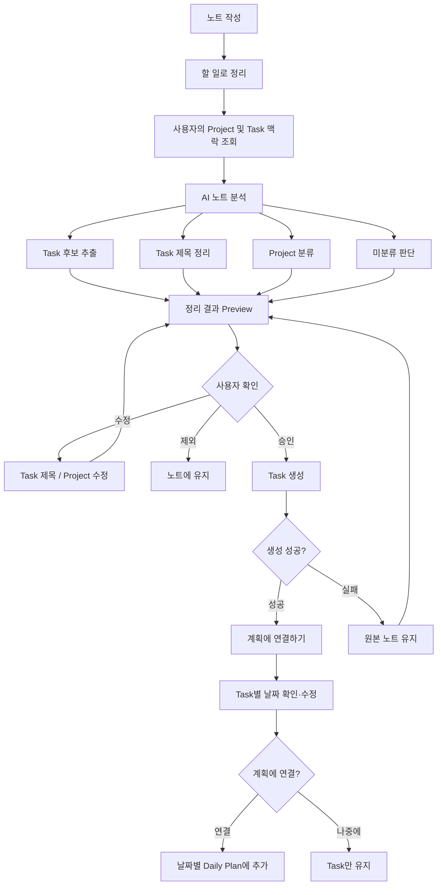

# AI 할 일 정리 기능 정의서

## 1. 기능 개요

사용자가 형식 없이 작성한 노트를 AI가 분석하여 **기존 Project에 맞는 Task 후보로 정리하고 분류하는 기능**이다.

사용자는 노트를 작성할 때 Project나 Task 형식을 고민하지 않고 떠오르는 내용을 그대로 기록한다. 이후 `할 일로 정리`를 실행하면 AI가 노트 전체를 읽고 Task 단위로 재구성한다.

이 기능은 원본 Pinboard Skill의 **“수집할 때 판단하지 않고, 나중에 AI가 구조화한다”**는 방식을 Project → Task 구조에 맞게 단순화한다.

---

## 2. 목적

* 노트 작성 시 사용자의 분류 부담을 줄인다.
* 러프한 생각을 실제 실행 가능한 Task로 변환한다.
* 노트에서 Project → Task → Focus로 자연스럽게 이어지게 한다.
* AI 오분류로 인한 데이터 오염을 막기 위해 사용자 승인 후 Task를 생성한다.

Swimming의 기존 핵심 구조인 `Project → Task → Session` 앞에 빠른 수집 단계를 추가하는 기능이다.

```text
Capture → Organize → Focus

노트
 ↓
AI 할 일 정리
 ↓
Project / Task
 ↓
집중 세션
```

---

## 3. 주요 기능

| 기능         | 설명                                      |
| ---------- | --------------------------------------- |
| 자유 노트 작성   | 사용자는 Project를 선택하지 않고 자유롭게 내용을 작성한다.    |
| Task 추출    | AI가 노트 전체를 읽고 실행 가능한 할 일을 추출한다.         |
| Task 제목 정리 | 러프한 문장을 짧고 명확한 Task 제목으로 변환한다.          |
| Project 분류 | 사용자의 기존 Project 맥락을 기준으로 Task를 분류한다.    |
| 미분류 처리     | Project 판단이 어려운 항목은 프로젝트 없는 Task 후보로 둔다.   |
| 결과 Preview | AI가 정리한 결과를 실제 저장 전에 보여준다.              |
| 사용자 수정     | Task 제목, Project, 생성 여부를 사용자가 수정할 수 있다. |
| Task 생성    | 사용자가 승인한 항목은 Project 연결 여부와 관계없이 Task로 생성한다. |
| 계획 연결      | Task 생성 후 별도 단계에서 날짜를 정해 Daily Plan에 연결한다. |
| 원본 정리      | Task 생성에 성공한 노트만 제거한다. 실패·미분류 항목은 유지한다. |

---

## 4. 핵심 규칙

1. AI는 **노트 전체를 먼저 읽은 뒤** Task를 분리한다.
2. 한 문장을 반드시 하나의 Task로 만들 필요는 없다.
3. 의미가 이어지는 노트는 하나의 Task로 병합할 수 있다.
4. Project 판단이 불확실하면 `미분류`로 처리한다.
5. AI가 만든 결과는 바로 저장하지 않고 반드시 Preview를 거친다.
6. 사용자가 승인한 Task만 생성한다.
7. Task 생성에 성공한 원본만 노트에서 제거한다.
8. 기존 Project와 Task 정보는 AI 분류를 위한 맥락으로만 사용하며, 값이 있는 Project ID만 서버에서 사용자 소유 여부를 다시 검증한다.
9. Task 생성과 계획 연결은 분리하며, 계획 연결을 건너뛰어도 생성된 Task는 유지한다.
10. 계획 날짜는 오늘을 기본값으로 두고 사용자가 Task별로 변경한다.

원본 Skill 역시 AI가 병합·요약·분류한 결과는 실제 쓰기 전에 사용자에게 보여주고 승인받으며, 종착지 생성 성공 후에만 원본을 정리하는 방식을 사용한다.

---

## 5. User Flow



---

## 6. 화면 상태

### 기본 상태

```text
노트

떠오르는 일을 편하게 적어두세요.

...

정리하면 비워집니다        ✨ 할 일로 정리
```

### AI 정리 결과

```text
Swimming · 2

☑ Refresh Token 처리 검증
  Swimming ▾

☑ 장소 조회 캐시 적용
  Swimming ▾


포트폴리오 · 1

☑ AWS 아키텍처 수정
  포트폴리오 ▾


미분류

운동화 주문


[취소]                   [4개 Task 만들기]
```

- 정리 결과는 Note 위젯 안에서 인라인 Preview로 전환해 표시한다.
- 분류·미분류 Task 후보를 모두 기본 선택한다.
- 미분류 항목은 `projectId=null`인 사용자 소유 Task로 생성한다.
- 사용자는 각 항목의 제목과 Project를 수정할 수 있다.
- 마음에 들지 않는 항목은 선택 해제하거나 `빼기`로 승인 대상에서 제외할 수 있으며 원문은 Note에 유지한다.
- `sourceText`는 승인 검증에만 사용하고 UI에는 표시하지 않는다.

---

## 7. 예시

### 입력

```text
포트폴리오 aws 구조 그림 수정
로그인 refresh token 처리 확인
장소조회 캐시 테스트 아직 못함
운동화 주문
```

### AI 정리 결과

| Task                | Project  |
| ------------------- | -------- |
| AWS 아키텍처 다이어그램 수정   | 포트폴리오    |
| Refresh Token 처리 검증 | Swimming |
| 장소 조회 캐시 테스트        | Swimming |
| 운동화 주문              | 미분류      |

---

## 8. 시스템 흐름

현재 Swimming의 백엔드는 `Controller → UseCase → Service → Repository` 구조이며, 여러 도메인이 엮이는 사용자 행동은 UseCase가 조율한다.

```text
Frontend
   │
   │ 할 일로 정리
   ▼
TaskOrganizerController
   │
   ▼
TaskOrganizerUseCase
   │
   ├─ ProjectService
   │    └─ Project 정보 조회
   │
   ├─ TaskService
   │    └─ 기존 Task 조회
   │
   └─ AI Organizer
        └─ Task 추출 / 분류

   ↓

Preview

   ↓ 사용자 승인

TaskService
   │
   └─ Task 생성

   ↓ 생성된 Task ID 반환

계획에 연결하기
   │
   ├─ Task별 날짜 선택
   └─ 날짜별 Task ID 묶음 생성

   ↓

DailyPlanController
   │
   └─ 기존 Daily Plan 항목 추가 API로 연결
```

---

## 9. MVP 범위

### API Contract

모든 경로는 `/api`를 프리픽스로 사용하며 인증된 사용자의 리소스만 다룬다.

| 메서드 | 경로 | 성공 응답 | 설명 |
| --- | --- | --- | --- |
| POST | `/task-organizer/preview` | `200 OK` + `TaskOrganizeResponse` | Note 원문을 Task 후보와 미분류 항목으로 정리한다. |
| POST | `/task-organizer/confirm` | `200 OK` + `TaskOrganizeConfirmResponse` | 사용자가 승인한 Task를 생성하며 원문 Note는 변경하지 않는다. |
| POST | `/daily-plans/{date}/items` | `200 OK` + `DailyPlanResponse` | 생성된 Task ID를 사용자가 선택한 날짜의 계획에 연결한다. |

승인 요청은 `noteId`와 사용자가 선택·수정한 `tasks`를 받는다. 각 Task의 `sourceText`는 현재 Note 원문과의 일치 여부를 검증하는 용도로만 사용하며 UI와 응답에는 표시하지 않는다. 생성된 Task의 `source_note_id`에는 요청의 `noteId`를 저장한다. 승인 처리는 하나의 트랜잭션으로 실행하고 원문 Note의 내용·상태·수정 시각은 변경하지 않는다. 응답은 생성된 `createdTasks`만 반환한다.

Task 생성 성공 후 프론트엔드는 `계획에 연결하기` 단계로 전환한다. 각 Task의 날짜는 오늘로 초기화하며 제목 오른쪽에 `MM/DD`로 표시한다. 날짜를 두 번 누르면 달력을 열어 변경할 수 있다. 연결 시 같은 날짜의 Task ID를 묶어 `{ "taskIds": [...] }`로 Daily Plan 항목 추가 API를 호출한다. 여러 날짜 요청 중 일부만 성공하면 성공한 Task는 목록에서 제거하고 남은 Task만 다시 시도한다. `나중에`를 선택하면 추가 API를 호출하지 않고 이미 생성된 Task를 유지한다.

### 포함

* 자유 노트 입력
* AI Task 추출
* 기존 Project 분류
* Task 제목 정리
* 미분류 처리
* Preview
* Project 변경
* Task 생성
* 생성된 Task에 원문 Note 연결
* 생성 후 계획 연결 단계
* Task별 계획 날짜 선택

### 제외

* 새로운 Project 자동 생성
* AI가 자동으로 Task를 저장하는 기능
* 기존 Task 자동 수정·병합
* 사용자 분류 습관 학습
* 음성 입력
* Task 일정·우선순위 자동 결정

MVP에서는 **`노트 → AI 정리 → Preview → Task 생성 → 계획 연결`** 흐름 자체의 유용성을 먼저 검증한다.
