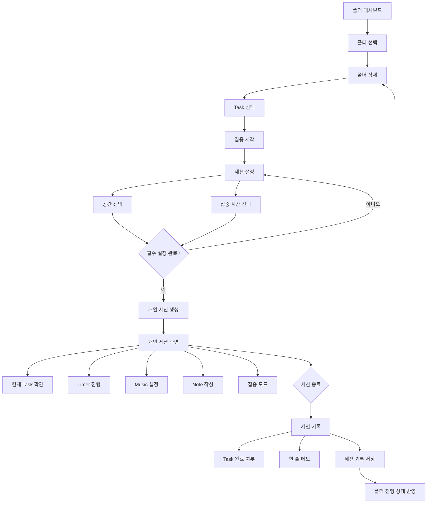
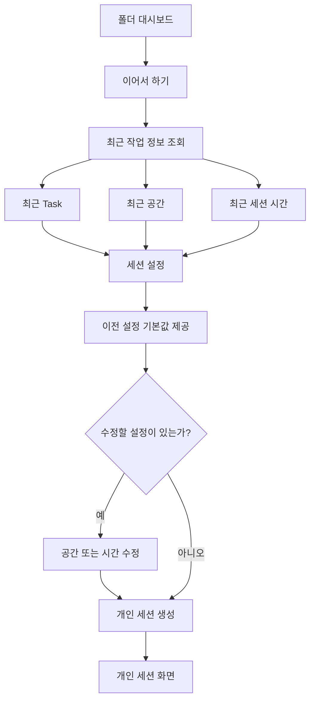
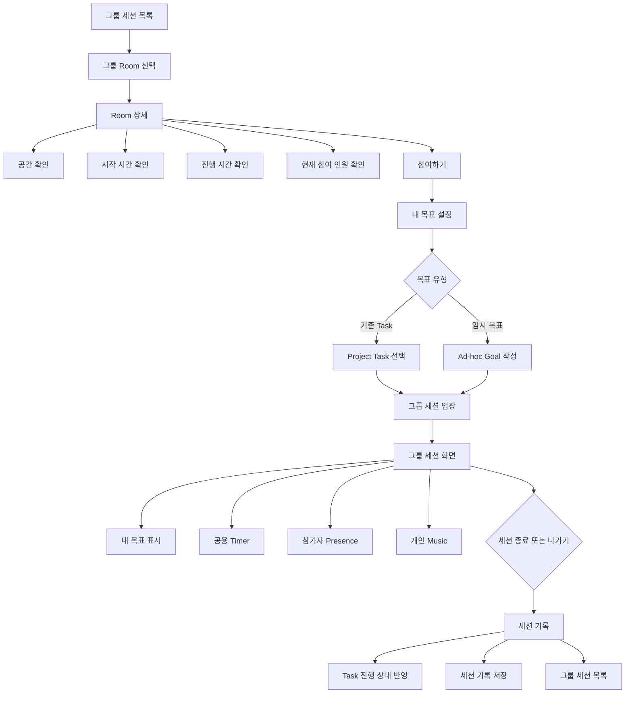
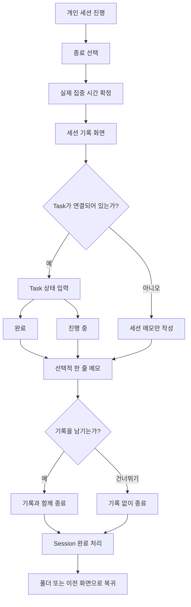
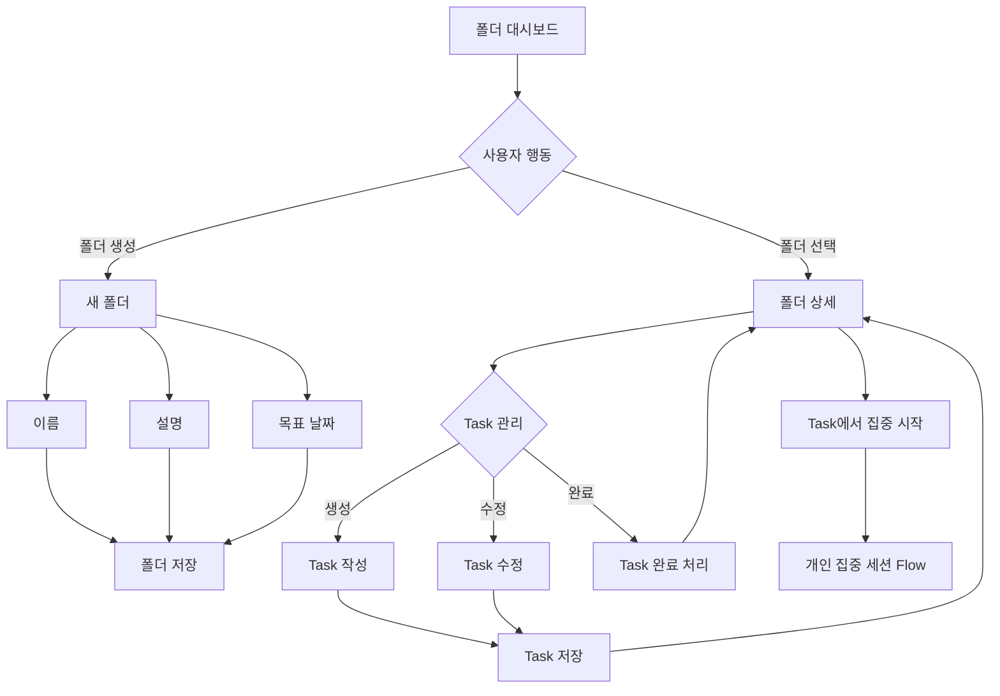
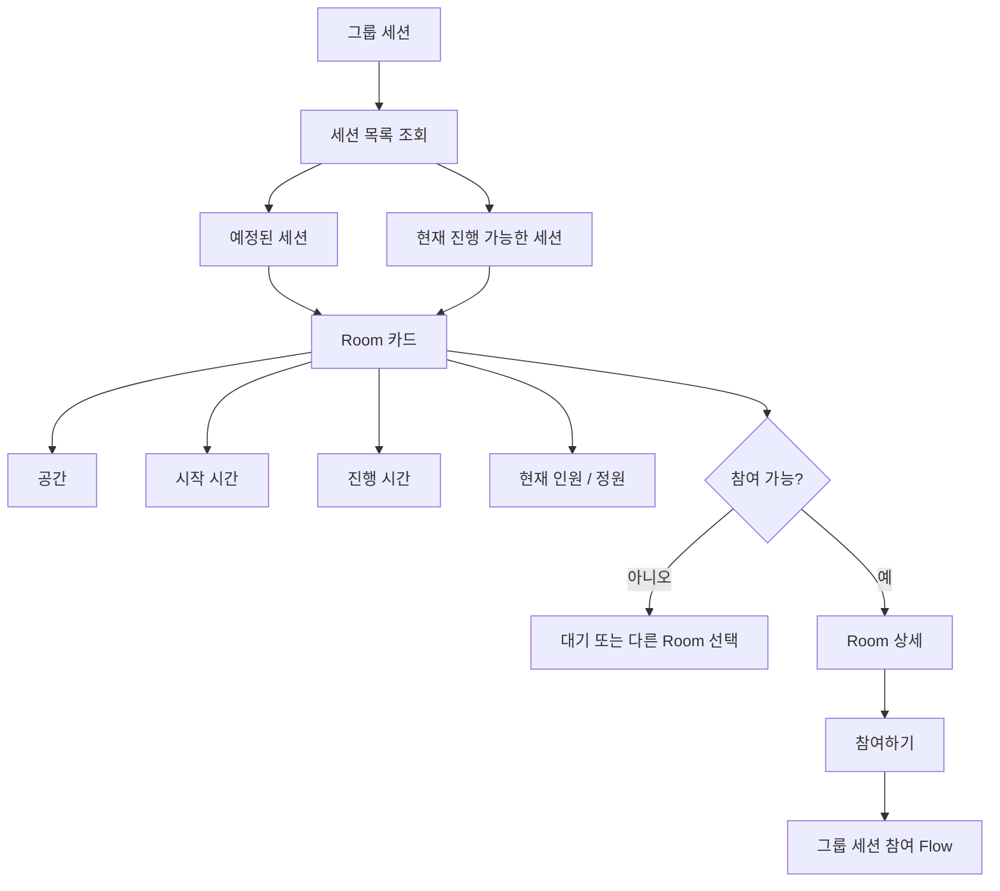
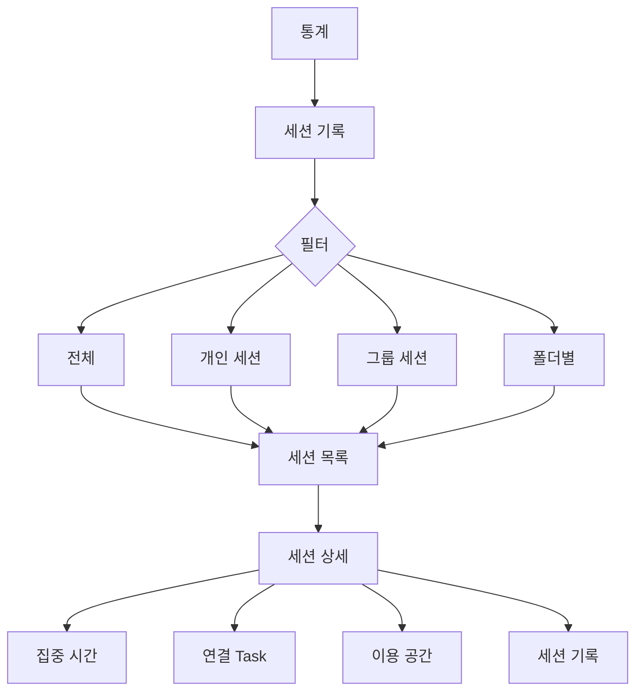
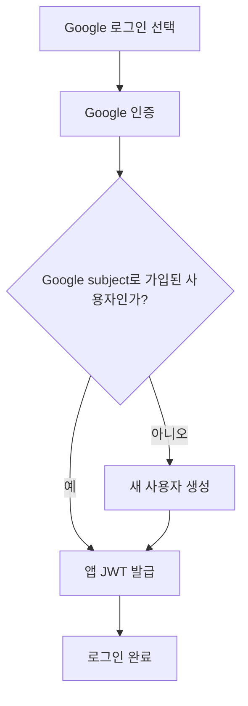
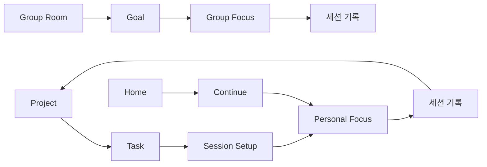

좋아. 지금까지 정한 UX를 반영해서, **BMAD Story의 상위 정본으로 쓰기 좋은 `user-flows.md`** 형태로 만들면 아래 정도가 좋아.

# User Flows

## 1. 개인 집중 세션

### 핵심 규칙

* 개인 세션은 `Project → Task`에서 시작한다.
* 세션 시작 전 필수 설정은 `공간`, `집중 시간`으로 제한한다.
* 음악과 노트는 세션 진행 중 변경할 수 있다.
* 세션 종료 시 함께 남기는 세션 기록으로 Task 진행 상태를 갱신한다.
* 세션 이력은 기록 작성 여부와 관계없이 보존한다.

---

## 2. 빠른 재진입

### 핵심 규칙

* 재방문 사용자의 반복 진입 단계를 최소화한다.
* 최근 Task, 공간, 세션 시간을 기본값으로 제안한다.
* 사용자는 필요한 값만 수정하고 바로 세션을 시작할 수 있다.

---

## 3. 그룹 세션 참여

### 핵심 규칙

* 그룹 세션에서는 공간과 시간은 Room이 결정한다.
* 사용자는 입장 전에 자신의 목표만 설정한다.
* 목표는 기존 Task 또는 임시 목표 중 하나를 선택할 수 있다.
* 공용 Timer는 사용자 개인이 변경할 수 없다.
* Music은 개인 설정으로 유지한다.
* 참가자는 채팅보다 Presence 중심으로 표현한다.

---

## 4. 개인 세션 종료 및 기록

### 핵심 규칙

* 세션 기록은 종료와 한 번에 저장한다. 기록 유무가 세션의 종료 여부나 실제 집중 시간을 바꾸지 않는다.
* 사용자가 기록을 건너뛰어도 세션은 정상 종료된다.
* Task가 연결된 경우에만 Task 진행 상태를 갱신한다.

---

## 5. 폴더 및 Task 관리

### 핵심 규칙

* Project는 장기 목표 단위다.
* Task는 실제 집중 세션과 연결되는 실행 단위다.
* 폴더 진행률은 Task 상태를 기반으로 보여준다.
* Task에서 바로 개인 집중 세션으로 진입할 수 있어야 한다.

---

## 6. 그룹 세션 목록 탐색

---

## 7. 세션 기록 조회

---

## 8. Google 로그인

### 핵심 규칙

* Google ID 토큰의 서명, issuer, audience, 만료와 이메일 검증 여부를 백엔드에서 확인한다.
* 사용자 식별에는 변경될 수 있는 이메일이 아니라 Google `sub`를 사용한다.
* Google `sub`가 처음 확인되면 새 사용자를 생성한다.
* 앱은 Google 토큰을 세션으로 사용하지 않고 자체 access token과 refresh cookie를 발급한다.

---

# Core Flow Summary

## 제품 흐름 원칙

1. **Project와 Focus는 직접 연결한다.**

    * Task를 관리하는 것에서 끝나지 않고 실제 집중 행동으로 이어져야 한다.

2. **개인 세션 시작 전 설정은 최소화한다.**

    * 공간
    * 집중 시간

3. **세션 진행 중의 조작은 My Desk 안에서 처리한다.**

    * Task
    * Timer
    * Music
    * Note
    * Focus Mode

4. **그룹 세션은 개인 세션과 다른 진입 흐름을 가진다.**

    * 개인: `Task → Space → Focus`
    * 그룹: `Room → Goal → Focus`

5. **모든 Focus 경험은 기록으로 돌아온다.**

    * Focus → 세션 기록 → Task / Project Progress

6. **재방문 사용자는 가능한 한 빠르게 Focus로 복귀할 수 있어야 한다.**

    * `Home → 이어서 하기 → Focus`

7. **Social 기능보다 Presence를 중요한다.**

    * 그룹 세션의 핵심은 대화가 아니라 함께 집중하고 있다는 감각이다.
